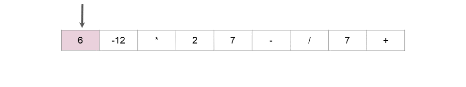
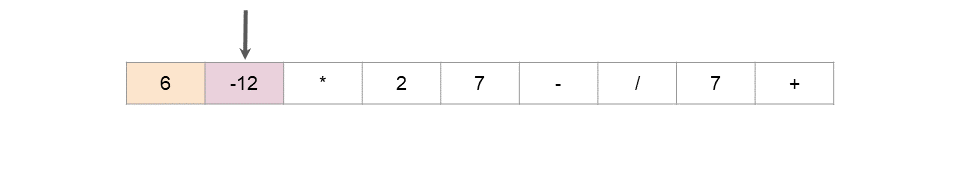
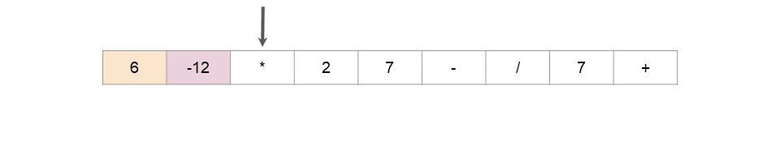
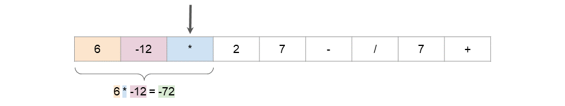

## What is Infix Notation?

Analysing Infix Notation provides some great context for understanding Reverse Polish Notation.

Most people know how to read expressions written using Infix Notation. Evaluating the following expression is something you will have learned to do in elementary school.
```
3 + 1 + 9 - 5 = 8
```
This isn't too difficult. However, many of you will also have seen viral posts circulating social media websites, such as Facebook, that challenge you to evaluate an expression like:
```
5 * 4 + 9 - 2 / 3 + 1 = ?
```
When you check the comments, among many other strange answers, you'll probably see people arguing about whether the answer is 10, 27.33, or 29.33.

The reason for the disagreement is because different people have different understandings about how such an expression should be evaluated.

Those who say the answer is 10 evaluated it strictly from left to right, with the following steps:
```
5 * 4 = 20
20 + 9 = 29
29 - 2 = 27
27 / 3 = 9
9 + 1 = 10
```
Those who say the answer is 27.33 follow a rule where we evaluate operations in the following order; division, multiplication, addition, and subtraction. This method comes from a common misunderstanding of the widely used mnemonics: PEMDAS/BODMAS/BEDMAS. The steps with this method are as follows:
```
= 5 * 4 + 9 - 0.66 + 1 (Do division first.)
= 20 + 9 - 0.66 + 1 (Do multiplication second.)
= 29 - 1.66 (Do the additions third.)
= 27.33 (Do the subtraction fourth.)
```
Those who say the answer is 29.33 use the rules most programming languages use, and that is also the correct interpretation of the mnemonics (PEMDAS/BODMAS/BEDMAS). That is to do division and multiplication first, in order from left to right, and then addition and subtraction, in order from left to right. Their steps are as follows:
```
= 20 + 9 - 2 / 3 + 1 (Do the multiplication.)
= 20 + 9 - 0.66 + 1 (Do the division.)
= 29 - 0.66 + 1 (Do the first addition.)
= 28.33 + 1 (Do the subtraction, as it's next.)
= 29.33 (Do the last addition.)
```
Most mathematicians would agree that the correct answer is 29.33. Yet, this is probably not the answer you'd get if you asked a random sample of people in the general public (just look at the Facebook posts!). In school for example, I was taught the method that gives 28.33. It wasn't until I learned programming in university that I learned the correct way!

When we want to do the operations in a different order, we use parenthesis (brackets) around the parts to do first. The parts in parenthesis are always done before the parts outside.

The big disadvantage of Infix Notation is hopefully clear now. The rules for evaluating it are surprisingly complex, cause a lot of confusion, and in fact most people don't understand them properly. Additionally, the need to use parentheses correctly adds another layer of complexity.

As we move towards understanding what Reverse Polish Notation is, keep in mind that while it seems a bit strange and un-intuitive (at first!), that Infix Notation is actually more confusing. The only reason Infix Notation seems intuitive is because you've probably been using it all your life and so it is now second nature to you. People who use Reverse Polish Notation on a daily basis find it very intuitive! Some hand-held calculators still use it! 


## What is Reverse Polish Notation?

Just like Infix Notation, or in fact any other notation, Reverse Polish Notation has rules for how to evaluate it. You'll need to know these rules before you can write an algorithm. The rules could either be prior knowledge or supplied by an interviewer.

        While there are operators remaining in the list, find the left-most operator. Apply it to the 2 numbers immediately before it, and replace all 3 tokens (the operator and 2 numbers) with the result.

For example in the most simplest case of 3 4 + when we reach + we can replace 3 4 + with it's result 7.

As long as the input was valid, this rule will always work and leave a single number that should be returned. The leftmost operator that hasn't yet been removed will always have 2 numbers immediately before it.

Here is an animation showing a more complicated example.









Hopefully the advantage is obvious now. Reverse Polish Notation doesn't require brackets, and the rules for evaluating it are far simpler. 
